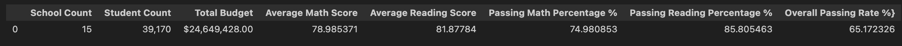
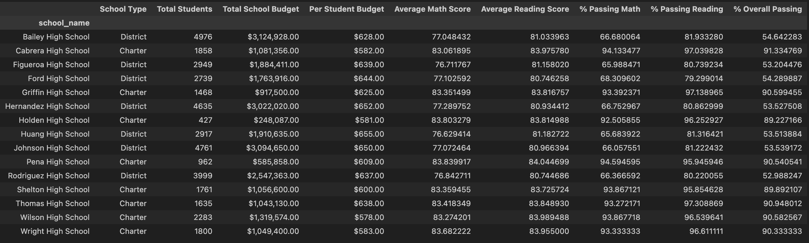
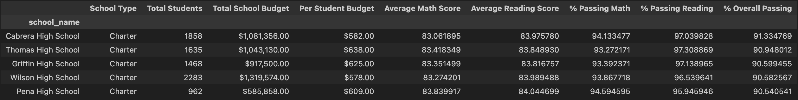
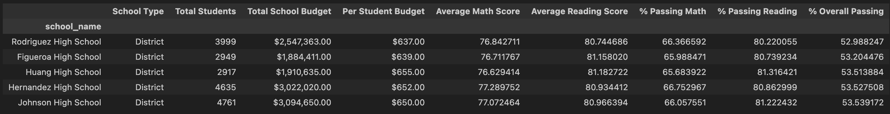

# pandas-challenge
Pandas Challenge related files are in the repository

# Solution
There is one folder called PyCitySchools in which you will find the file with the code and the Resources folder.

# ScreenShots
I have uploaded the screenshots for the output for District Summary, School Summary, Highest Performing School (by % Overall Passing), Bottom Performing School (by % Overall Passing), Math Scores by Grade, Reading Scores by Grade, Scores by School Spending, Scores by School Size, and Scores by School Type.

## PyCity Schools Analysis
- The dataset contains a total of 15 schools with 39,170 students. Overall, the average for the reading score (81.87784) is higher than math score (78.985371). When we calculated the passing rate of 70 or higher for both reading and math score, we found that the passing reading score percent (85.805463) is higher than the passing math score percent (74.980853). The overall passing rate for both math and reading was 65.172326 %. From the overall data, we can conclude that students scored more on reading. 
- From the data, we can conclude that out of the total 15 schools, there are 7 schools at the district level and 8 schools at the charter level. The number of students size ranges from as low as 427 at Holden High School and as larger as 4976 at Bailey High School. The total number of students at charter level is 12,194 and the total number of students at district level is 26,976. We can conclude that Charter schools collectively enroll fewer students compared to district schools. 
- From the data, we can conclude that the school size makes a difference on the average math scores, average reading scores, overall passing score, passing math and passing reading scores. The smaller the size of the school meaning the less students, the higher the scores were. The increase in student size has a negative influence on student's grade and achievement. Therefore, schools should work on their school size so the student grade and achievement can increase. 
- We can conclude from the data, that as higher budget does not necessarily guarantee better academic performance. The highest budget was allocated to Bailey High School (3,124,928.00) and the lowest budget was allocated to Holden High School ($248,087.00). Even though Bailey High School had a higher budget, Holden High School students had a higher average for both math and reading, higher passing math and passing reading percentage and a higher overall passing rate compared to Bailey High School. Based the data, we can conclude that the relationship between performance of student grades and budget is complex and can be influenced by various factors such as quality of the teacher, school culture, class size, curriculum and so on. Further research has to be done on how the extra money at Bailey High School can be put into better use to help increase student grades and achievement.
  
## District Summary
Include the following:
- Total number of unique schools
- Total students
- Total budget
- Average math score
- Average reading score
- % passing math (the percentage of students who passed math)
- % passing reading (the percentage of students who passed reading)
  % overall passing (the percentage of students who passed math AND reading)

## School Summary
Include the following:
- School name
- School type
- Total students
- Total school budget
- Per student budget
- Average math score
- Average reading score
- % passing math (the percentage of students who passed math)
- % passing reading (the percentage of students who passed reading)
- % overall passing (the percentage of students who passed math AND reading)

## Highest Performing School (by % Overall Passing)

## Bottom Performing School (by % Overall Passing)

## Math Scores by Grade
## Reading Scores by Grade
## Scores by School Spending
## Scores by School Size
## Scores by School Type.
